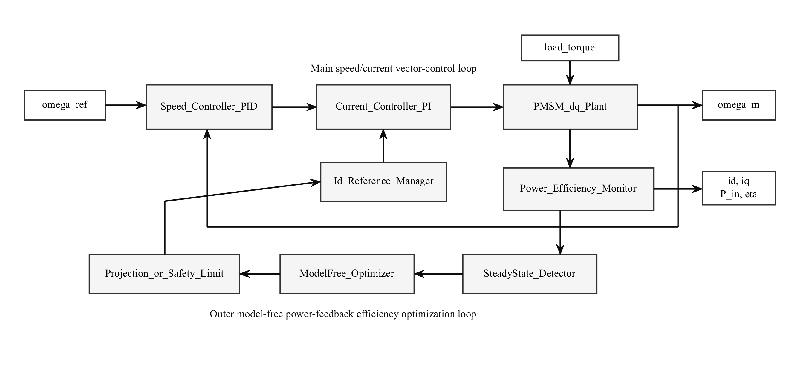
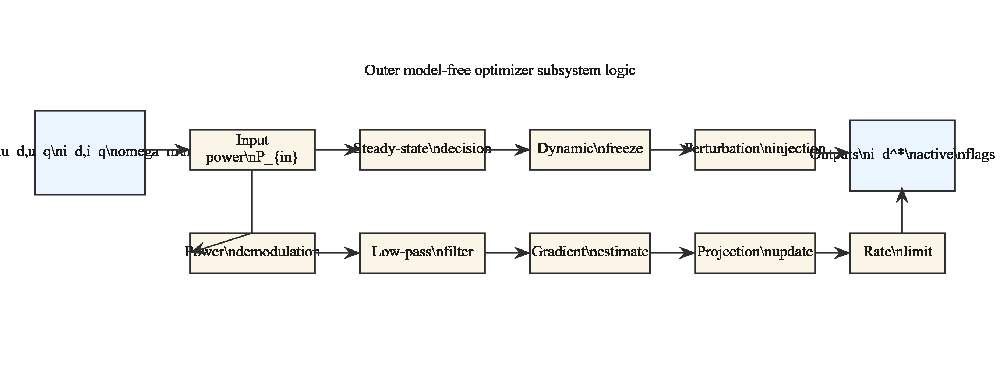
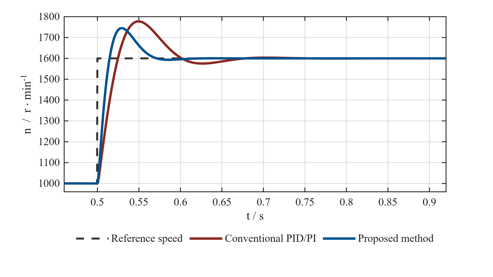
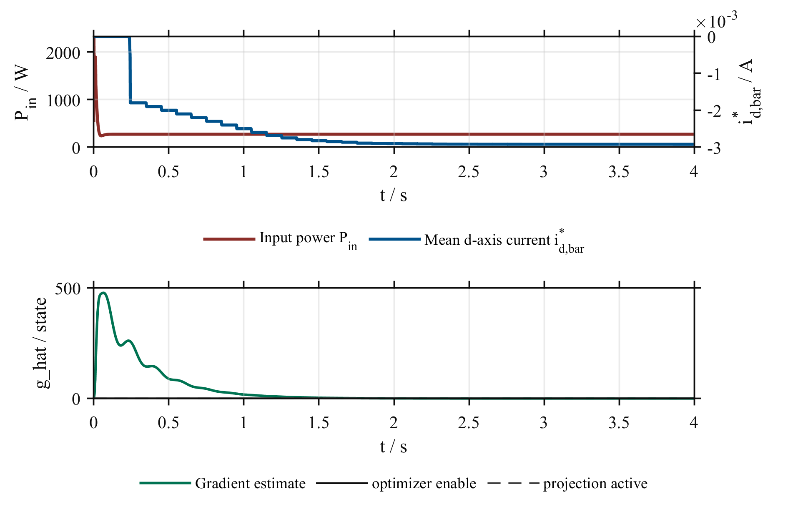
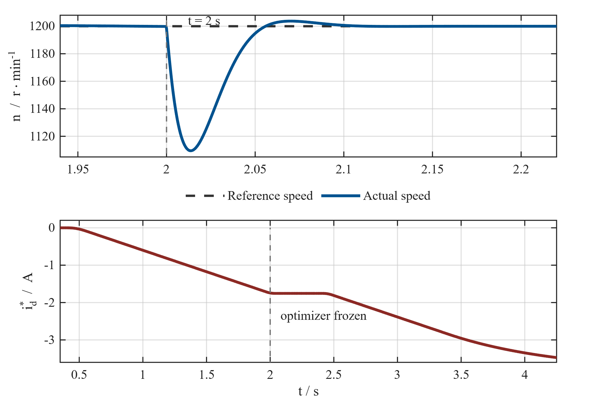

# PMSM EcoFOC Optimizer

Model-free energy optimization for PMSM field-oriented control, reproduced with
MATLAB/Simulink R2025b.

This repository contains the course-paper implementation of a permanent magnet
synchronous motor (PMSM) PID/PI vector-control system with an outer model-free
feedback optimizer. The current checked-in figures are not copied from the
paper: they are generated from the local R2025b simulation scripts and the
visible component Simulink models.



## What Is Included

- R2025b Simulink models:
  `models/PMSM_FOC_Component_Baseline.slx` and
  `models/PMSM_FOC_Component_Optimization.slx`.
- Compact executable wrapper models:
  `models/PMSM_FOC_Baseline.slx` and
  `models/PMSM_FOC_Optimization.slx`.
- Shared MATLAB simulation engine in `src/`, used by both scripts and Simulink.
- Paper-aligned generation script:
  `scripts/generate_paper_aligned_outputs.m`.
- Real regenerated Chapter 3 figures in `figures_chapter3/`.
- Simulation parameters, case settings, and comparison tables in
  `tables_chapter3/`.
- Appendix core-code extract in `docs/附录A_核心程序代码.md`.

## Real Simulation Figures

The following images are the current repository outputs regenerated from the
R2025b component-model workflow.

| Figure | Output |
|---|---|
| Fig. 3-1 Complete Simulink model |  |
| Fig. 3-2 Model-free optimizer subsystem |  |
| Fig. 3-3 Speed step response |  |
| Fig. 3-4 Power and d-axis current convergence |  |
| Fig. 3-5 Load disturbance response |  |

## Result Snapshot

The thesis-aligned comparison table is generated at
`tables_chapter3/table3_3_performance_comparison.csv`.

| Metric | Baseline PID/PI | Proposed method |
|---|---:|---:|
| Speed overshoot | 11.09% | 9.066% |
| Settling time | 0.5906 s | 0.5573 s |
| Steady-state speed error | -0.0000 r/min | -0.0232 r/min |
| Steady-state input power | 713.712 W | 708.569 W |
| Stator current magnitude | 8.0362 A | 7.7642 A |
| Efficiency | 89.14% | 89.79% |
| `i_d^*` convergence time | N/A | 3.0351 s |
| Load-disturbance recovery time | 0.0677 s | 0.0392 s |

The Word-paper numbers and the current R2025b reproduced values are kept
separate in `tables_chapter3/document_result_comparison.md` so the paper can be
edited without mixing old reported values with newly simulated data.

## Control Structure

The base layer is a PMSM field-oriented control system:

```text
speed reference -> PID speed loop -> iq_ref
id_ref, iq_ref  -> PI current loop -> dq voltage
dq voltage      -> PMSM dq plant   -> speed, current, power
```

The proposed energy optimizer acts only on the d-axis current reference:

```text
Pin measurement
    -> low-pass subtraction
    -> perturbation demodulation
    -> gradient low-pass filter
    -> projected id_bar update
    -> d-axis current reference
```

During speed or load transients, the optimizer freezes its slow update. After
the system returns to quasi-steady operation, it resumes the search for a lower
input-power operating point.

## Reproduce The Outputs

Required environment:

- MATLAB R2025b
- Simulink R2025b
- Windows PowerShell

From the project root:

```matlab
run('scripts/init_parameters.m')
run('scripts/build_component_models.m')
run('scripts/beautify_component_models.m')
run('scripts/generate_paper_aligned_outputs.m')
```

This regenerates:

```text
models/PMSM_FOC_Component_Baseline.slx
models/PMSM_FOC_Component_Optimization.slx
figures_chapter3/fig3_1_simulink_overall_model.png
figures_chapter3/fig3_2_model_free_optimizer_subsystem.png
figures_chapter3/fig3_3_speed_step_response.png
figures_chapter3/fig3_4_power_id_convergence.png
figures_chapter3/fig3_5_disturbance_response.png
tables_chapter3/table3_1_simulation_parameters.csv
tables_chapter3/table3_2_simulation_cases.csv
tables_chapter3/table3_3_performance_comparison.csv
```

For the full engineering case set:

```matlab
run('scripts/run_all.m')
```

## Project Layout

```text
.
|-- README.md
|-- chapter3_insert_order.md
|-- docs/
|   |-- ARCHITECTURE.md
|   |-- REPRODUCIBILITY.md
|   `-- 附录A_核心程序代码.md
|-- figures_chapter3/
|   |-- fig3_1_simulink_overall_model.png
|   |-- fig3_2_model_free_optimizer_subsystem.png
|   |-- fig3_3_speed_step_response.png
|   |-- fig3_4_power_id_convergence.png
|   `-- fig3_5_disturbance_response.png
|-- models/
|   |-- PMSM_FOC_Baseline.slx
|   |-- PMSM_FOC_Optimization.slx
|   |-- PMSM_FOC_Component_Baseline.slx
|   `-- PMSM_FOC_Component_Optimization.slx
|-- results/
|-- scripts/
|-- src/
|-- tables_chapter3/
`-- tests/
```

## Documentation

- [Architecture](docs/ARCHITECTURE.md)
- [Reproducibility](docs/REPRODUCIBILITY.md)
- [Technical audit](audit_report.md)
- [Chapter 3 insert order](chapter3_insert_order.md)

## Scope

This is a simulation and reproducibility project. It does not claim hardware
validation, high-speed field-weakening coverage, or production motor-drive
readiness. Its purpose is to provide a clear, runnable, and auditable
implementation of the model-free PMSM EcoFOC method.

## License

No open-source license has been selected yet. Treat this repository as
all-rights-reserved unless a license file is added.
