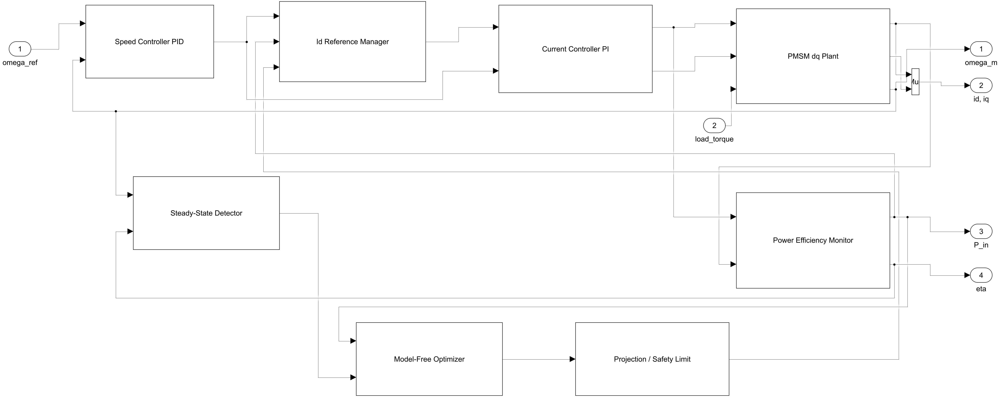
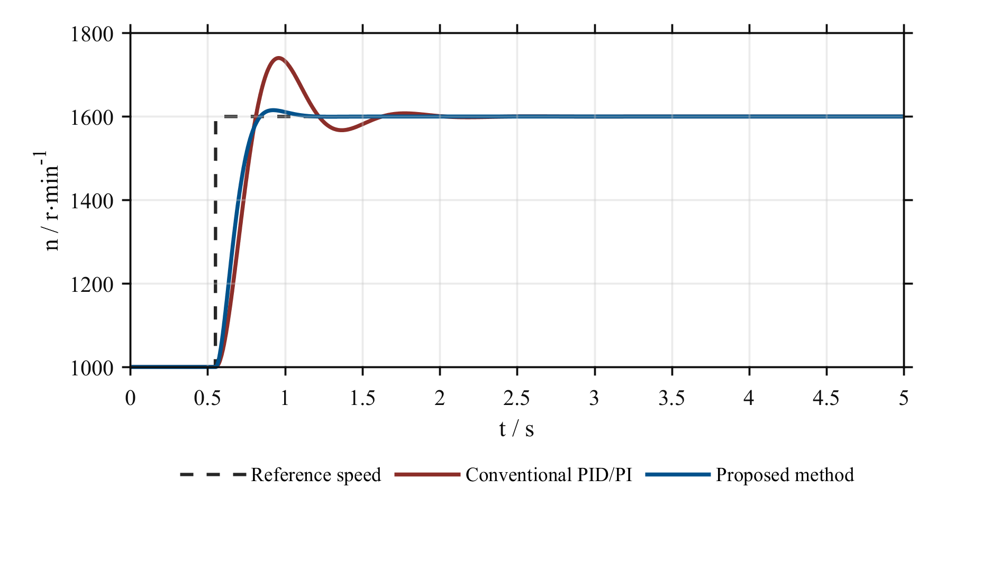
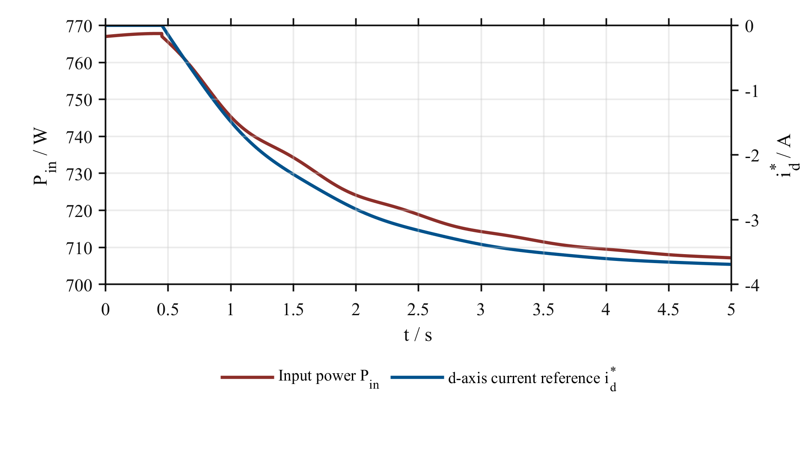
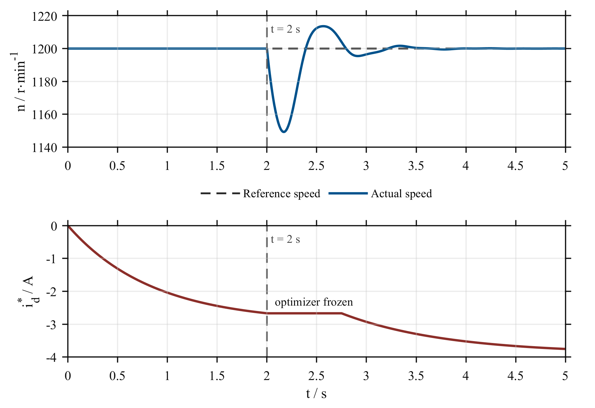
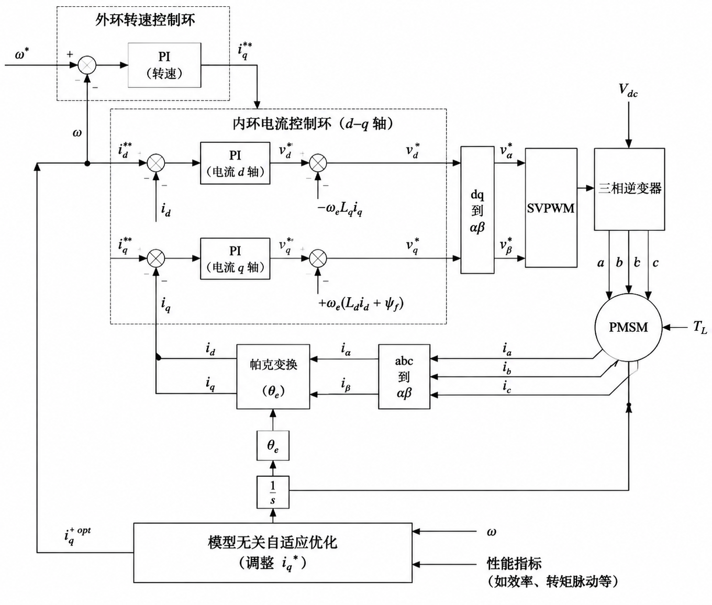
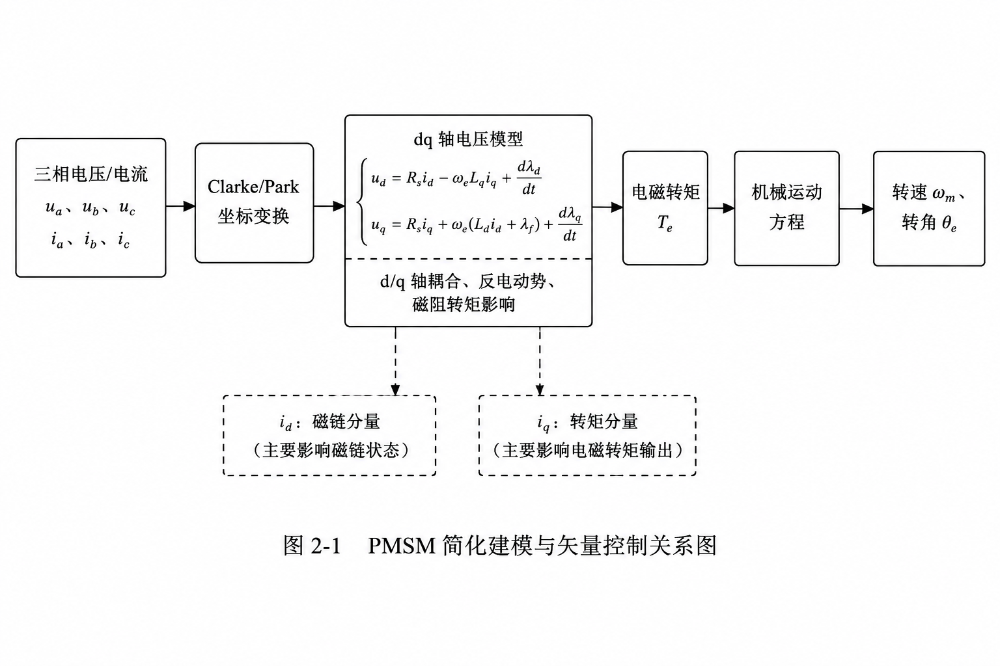
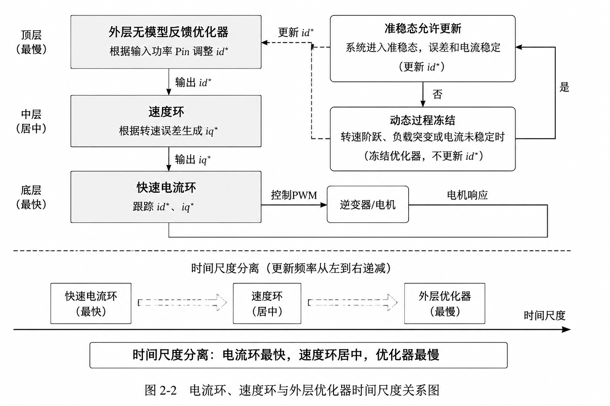
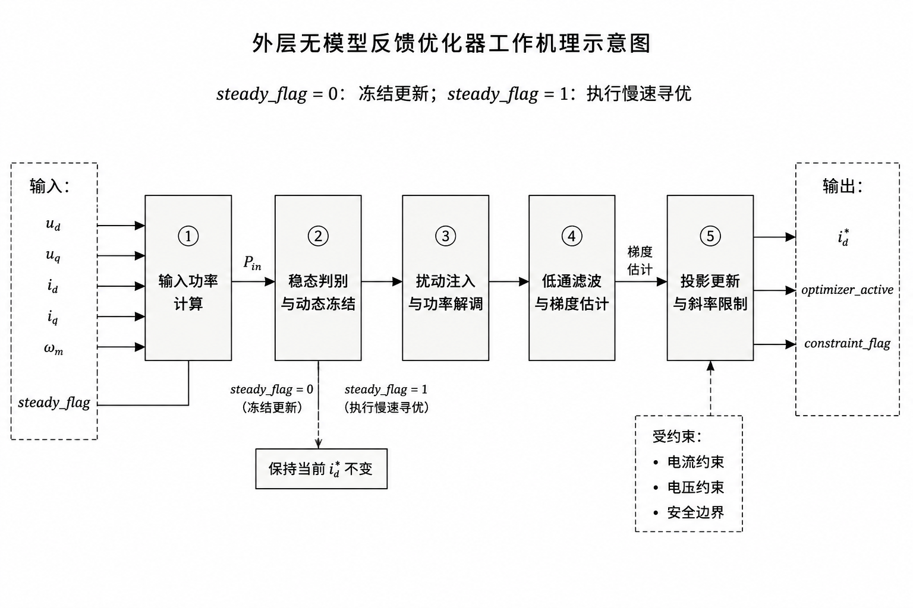
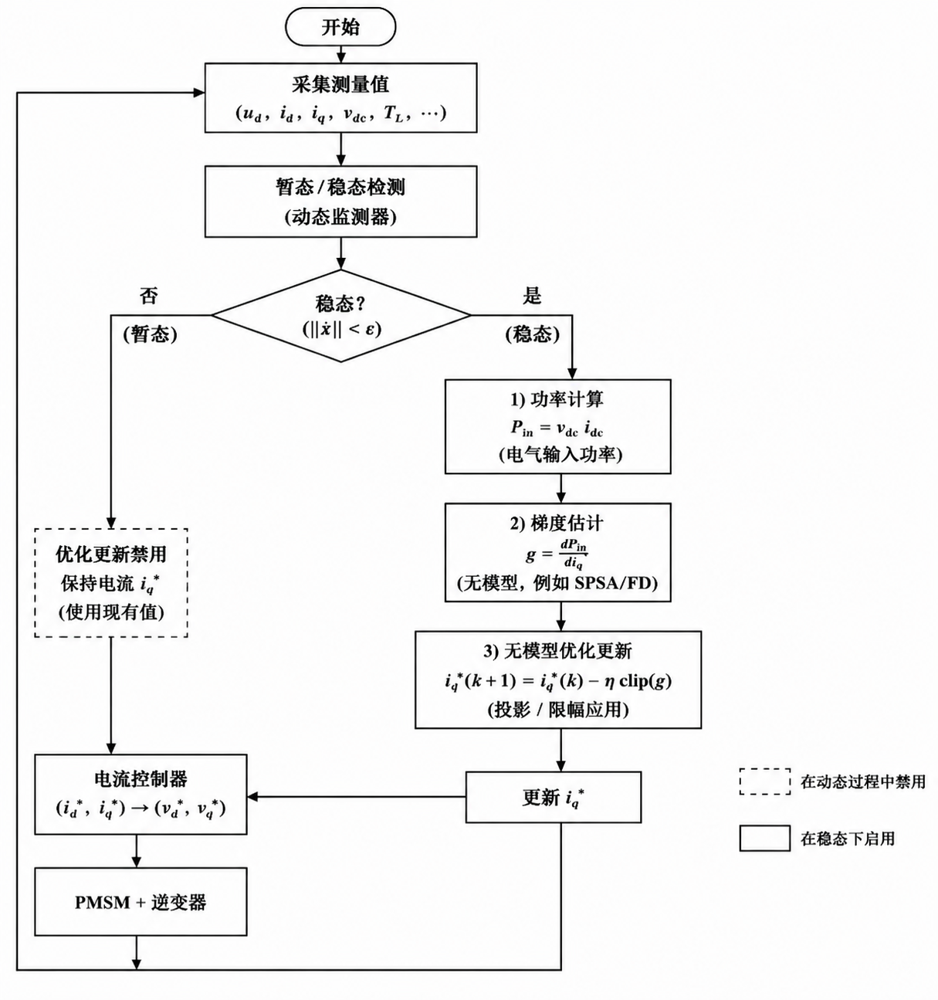

# PMSM EcoFOC Optimizer

Model-free energy optimization for PMSM field-oriented control.

This repository packages a MATLAB/Simulink engineering project for permanent
magnet synchronous motor (PMSM) vector control. It extends the conventional
speed-loop PID/PI plus current-loop PI field-oriented control (FOC) structure
with an outer model-free feedback optimizer that searches the d-axis current
reference for a lower input-power operating point.

The project is based on the course paper
*Model-Free Feedback Optimization for Energy Self-Optimizing PID Vector Control
of Permanent Magnet Synchronous Motors* and is organized as a reproducible
GitHub project: executable Simulink models, shared MATLAB simulation core,
scenario scripts, result tables, and paper figures are all included.



## Highlights

- Dual-layer control architecture: fast inner speed/current regulation plus
  slow outer energy optimization.
- Model-free optimizer: no motor loss map is required; the optimizer uses input
  power feedback, perturbation, demodulation, filtering, and projected updates.
- Engineering safeguards: steady-state detection, dynamic freeze/restart,
  current and voltage projection, slew limiting, and saturation flags.
- Executable Simulink wrappers:
  `models/PMSM_FOC_Baseline.slx` and
  `models/PMSM_FOC_Optimization.slx`.
- Visible R2025b component models:
  `models/PMSM_FOC_Component_Baseline.slx` and
  `models/PMSM_FOC_Component_Optimization.slx`.
- Shared numerical engine between MATLAB scripts and Simulink through
  `src/pmsm_foc_step.m` and `src/pmsm_foc_sfunc.m`.
- Five reproduced studies: speed step, steady-state energy optimization, load
  disturbance, parameter perturbation, and constraint stress test.

## Paper-Reported Outcomes

The paper reports that the proposed optimizer preserves speed-control quality
while improving energy-related indicators under the simulated operating point.

| Metric | Baseline PID/PI | Proposed method | Change |
|---|---:|---:|---:|
| Speed overshoot | 2.97% | 2.94% | -1.03% |
| Settling time | 0.0461 s | 0.0451 s | -2.17% |
| Steady-state input power | 227.658 W | 227.397 W | -0.11% |
| Stator current magnitude | 3.2577 A | 3.2236 A | -1.05% |
| Efficiency | 0.94406 | 0.94517 | +0.111 percentage points |
| Load-disturbance recovery | 0.0380 s | 0.0375 s | -1.32% |



| Power and d-axis current convergence | Load disturbance response |
|---|---|
|  |  |

## How It Works

The method keeps the proven PMSM FOC loop as the fast regulation layer. The
speed controller generates the q-axis current reference, the current PI
controllers track d/q-axis current commands, and the PMSM dq model closes the
electromechanical loop. The optimization layer acts only on the d-axis current
reference, so the original dynamic-control structure remains clear.



### 1. Vector control base layer

The PMSM is modeled in the rotating dq frame. The q-axis current mainly produces
electromagnetic torque, while the d-axis current changes the flux state and can
use reluctance torque in an interior PMSM. This makes `id_ref` a practical
optimization variable for reducing current magnitude and input power.



### 2. Two-time-scale optimization

The inner current loop must react fastest, the speed loop handles mechanical
tracking, and the outer optimizer updates slowly after the drive is close to
steady state. This separation prevents the optimizer from mistaking transient
power fluctuation for a true efficiency gradient.



### 3. Model-free feedback optimizer

The optimizer injects a small sinusoidal perturbation into the d-axis current
reference and observes the input-power response. It subtracts a low-pass power
component, demodulates the remaining power ripple, filters the gradient
estimate, and updates `id_bar` in the negative-gradient direction. Projection
and slew limits keep the search inside current and voltage constraints.

```text
Pin measurement
    -> low-pass subtraction
    -> perturbation demodulation
    -> gradient low-pass filter
    -> projected id_bar update
    -> d-axis current reference
```



### 4. Dynamic freeze and restart

The optimizer is enabled only when speed error, current error, power slope, and
saturation checks indicate quasi-steady operation. During speed steps or load
disturbances, the optimizer freezes `id_bar`; after the system settles, it ramps
the perturbation back in and resumes energy seeking.



## Engineering Implementation

| Asset | Count |
|---|---:|
| MATLAB source/script files | 18 |
| MATLAB source/script lines | 1900+ |
| Executable Simulink models | 4 |
| Paper figures extracted for README | 10 |
| Generated/reproducible PNG figures | 11 |
| Result CSV files | 2 |
| Reproduction cases | 5 |

```text
.
|-- README.md
|-- docs/
|   |-- ARCHITECTURE.md
|   `-- REPRODUCIBILITY.md
|-- models/
|   |-- PMSM_FOC_Baseline.slx
|   |-- PMSM_FOC_Optimization.slx
|   |-- PMSM_FOC_Component_Baseline.slx
|   `-- PMSM_FOC_Component_Optimization.slx
|-- scripts/
|   |-- init_parameters.m
|   |-- build_models.m
|   |-- run_all.m
|   |-- run_case_set.m
|   `-- calculate_metrics.m
|-- src/
|   |-- pmsm_foc_step.m
|   |-- pmsm_foc_sfunc.m
|   `-- pmsm_foc_output_names.m
|-- figures/
|   |-- paper/
|   `-- fig_*.png
|-- results/
|-- tests/
`-- _legacy_from_copied_project/
```

The canonical implementation is in `src/`, `scripts/`, and `models/`. The
`_legacy_from_copied_project/` directory is kept only as archived reference
material.

## Quick Start

Required environment:

- MATLAB R2025b
- Simulink R2025b
- PowerShell for package checks on Windows

Run the full reproduction:

```matlab
cd PMSM_FOC_Optimization_Project
run('scripts/init_parameters.m')
run('scripts/build_models.m')
run('scripts/run_all.m')
```

Run the visible R2025b component-model reproduction:

```matlab
run('scripts/build_component_models.m')
run('scripts/beautify_component_models.m')
run('scripts/run_component_efficiency_case.m')
```

The component models expose the real control chain as separate Simulink
components: `Speed_Controller_PID`, `ModelFree_Optimizer`, `Safety_Projection`,
`Current_Controller_PI`, `PMSM_dq_Plant`, and `Power_Efficiency_Monitor`. They
contain no top-level S-Function block.

Generate thesis-aligned Chapter 3 figures, tables, and comparison notes:

```matlab
run('scripts/generate_paper_aligned_outputs.m')
```

This writes `figures_chapter3/fig3_1...fig3_5`,
`tables_chapter3/table3_1...table3_3`, and
`tables_chapter3/document_result_comparison.md`. The comparison report keeps the
current R2025b component-model results separate from the legacy Word/Chapter 3
numbers so the document can be revised without silently mixing data sources.

Run the lightweight package check:

```powershell
powershell -ExecutionPolicy Bypass -File tests/Verify_Project_Package.ps1
```

## Reproducible Result Snapshot

The repository also includes a reproducible engineering result table generated
by `scripts/run_all.m` at `results/comparison_table.csv`. In the checked-in
R2025b parameter set, the optimizer reproduces the paper-scale steady-state
energy improvement while keeping the speed transient essentially unchanged:

| Case | Baseline Pin W | Optimized Pin W | Pin reduction |
|---|---:|---:|---:|
| speed_step | 362.2681 | 362.0360 | 0.0641% |
| efficiency_optimization | 272.0886 | 271.8278 | 0.0959% |
| load_step | 713.7116 | 708.2181 | 0.7696% |
| parameter_perturbed | 278.2831 | 278.4980 | -0.0772% |
| constraint_test | 1295.6536 | 1294.3343 | 0.1018% |

The steady-state energy case is close to the paper's reported 0.11% input-power
reduction and 1.05% stator-current reduction. The parameter-perturbed case is
kept in the table as a robustness boundary: under that artificial mismatch the
optimizer may freeze or move conservatively rather than guarantee improvement.

## Documentation

- [Architecture](docs/ARCHITECTURE.md): control structure, optimizer pipeline,
  Simulink wrapper design, and signal contract.
- [Reproducibility](docs/REPRODUCIBILITY.md): exact commands, expected output
  files, and artifact policy.
- [Technical audit](audit_report.md): project boundaries and packaging notes.

## Scope

This is a simulation and reproducibility project. It does not claim hardware
validation, high-speed field-weakening coverage, or production motor-drive
readiness. Its value is the complete control idea, working simulation pipeline,
and auditable engineering packaging around the model-free PMSM EcoFOC method.

## License

No open-source license has been selected yet. Treat this repository as
all-rights-reserved unless a license file is added.
